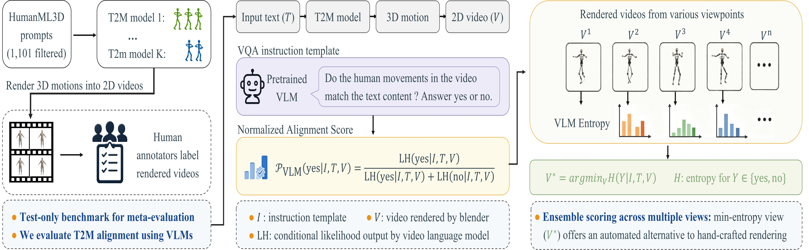

# VeMo: Zero-Shot Text-to-Motion Evaluation using Video Language Models

<div id="top" align="center">
<p align="center">

</p>
</div>

> 📝 **Paper**: https://openreview.net/pdf?id=Sf8ubkiEkW<br/>
> 📌 **Poster**: https://icml.cc/virtual/2026/poster/63904<br/>
> 💻 **GitHub**: https://github.com/spatial-westlakenlp/ActionReward<br/>
> ✒️ **Authors**: Yuwen Ji, Donglin Wang, Yue Zhang<br/>
> 📧 **Contact**: Yue Zhang &lt;zhangyue@westlake.edu.cn&gt;<br/>

## 📢 News
- **2026/05/19** Camera-ready open-source release page prepared.

## 📄 Introduction

- VeMo evaluates text-to-motion alignment by rendering generated 3D motions into videos and scoring them with pretrained video-language models.
- The method is zero-shot: it does not require motion-specific training labels.
- VeMo also includes an entropy-based view selection strategy to reduce information loss from 3D-to-2D rendering.
- The accompanying benchmark is test-only and human-annotated, designed for meta-evaluation of T2M metrics.

## 🧩 Demo Cases

Representative cases where VeMo matches the human label while baselines do not.

<div align="center">
<table width="100%" cellspacing="0" cellpadding="0">
<tr>
<td align="center" valign="top" width="20%">
<video src="assets/cases/001014-mdm.mp4" width="100%" controls muted loop playsinline></video><br/>
<b>001014 · MDM</b>
</td>
<td align="center" valign="top" width="20%">
<video src="assets/cases/001359-mdm.mp4" width="100%" controls muted loop playsinline></video><br/>
<b>001359 · MDM</b>
</td>
<td align="center" valign="top" width="20%">
<video src="assets/cases/001384-mdm.mp4" width="100%" controls muted loop playsinline></video><br/>
<b>001384 · MDM</b>
</td>
<td align="center" valign="top" width="20%">
<video src="assets/cases/000439-mdm.mp4" width="100%" controls muted loop playsinline></video><br/>
<b>000439 · MDM</b>
</td>
<td align="center" valign="top" width="20%">
<video src="assets/cases/001349-mdm.mp4" width="100%" controls muted loop playsinline></video><br/>
<b>001349 · MDM</b>
</td>
</tr>
<tr>
<td align="center" valign="top" width="20%">
<video src="assets/cases/000825-mgpt.mp4" width="100%" controls muted loop playsinline></video><br/>
<b>000825 · MotionGPT</b>
</td>
<td align="center" valign="top" width="20%">
<video src="assets/cases/001008-mgpt.mp4" width="100%" controls muted loop playsinline></video><br/>
<b>001008 · MotionGPT</b>
</td>
<td align="center" valign="top" width="20%">
<video src="assets/cases/000374-mgpt.mp4" width="100%" controls muted loop playsinline></video><br/>
<b>000374 · MotionGPT</b>
</td>
<td align="center" valign="top" width="20%">
<video src="assets/cases/001250-mgpt.mp4" width="100%" controls muted loop playsinline></video><br/>
<b>001250 · MotionGPT</b>
</td>
<td align="center" valign="top" width="20%">
<video src="assets/cases/000307-mgpt.mp4" width="100%" controls muted loop playsinline></video><br/>
<b>000307 · MotionGPT</b>
</td>
</tr>
<tr>
<td align="center" valign="top" width="20%">
<video src="assets/cases/000704-motionlcm.mp4" width="100%" controls muted loop playsinline></video><br/>
<b>000704 · MotionLCM</b>
</td>
<td align="center" valign="top" width="20%">
<video src="assets/cases/001038-motionlcm.mp4" width="100%" controls muted loop playsinline></video><br/>
<b>001038 · MotionLCM</b>
</td>
<td align="center" valign="top" width="20%">
<video src="assets/cases/001059-motionlcm.mp4" width="100%" controls muted loop playsinline></video><br/>
<b>001059 · MotionLCM</b>
</td>
<td align="center" valign="top" width="20%">
<video src="assets/cases/000576-motionlcm.mp4" width="100%" controls muted loop playsinline></video><br/>
<b>000576 · MotionLCM</b>
</td>
<td align="center" valign="top" width="20%">
<video src="assets/cases/000820-motionlcm.mp4" width="100%" controls muted loop playsinline></video><br/>
<b>000820 · MotionLCM</b>
</td>
</tr>
<tr>
<td align="center" valign="top" width="20%">
<video src="assets/cases/000742-stablemofusion.mp4" width="100%" controls muted loop playsinline></video><br/>
<b>000742 · StableMoFusion</b>
</td>
<td align="center" valign="top" width="20%">
<video src="assets/cases/000304-stablemofusion.mp4" width="100%" controls muted loop playsinline></video><br/>
<b>000304 · StableMoFusion</b>
</td>
<td align="center" valign="top" width="20%">
<video src="assets/cases/000091-stablemofusion.mp4" width="100%" controls muted loop playsinline></video><br/>
<b>000091 · StableMoFusion</b>
</td>
<td align="center" valign="top" width="20%">
<video src="assets/cases/000421-stablemofusion.mp4" width="100%" controls muted loop playsinline></video><br/>
<b>000421 · StableMoFusion</b>
</td>
<td align="center" valign="top" width="20%">
<video src="assets/cases/000749-stablemofusion.mp4" width="100%" controls muted loop playsinline></video><br/>
<b>000749 · StableMoFusion</b>
</td>
</tr>
</table>
</div>


## ⚙️ Setup

```bash
cd VeMo
conda create -n vemo python=3.11
conda activate vemo
pip install -r requirements.txt
```

## 📦 Resources

- Download [OpenGVLab/InternVL3-14B](https://huggingface.co/OpenGVLab/InternVL3-14B) to `./storage/vlm/InternVL3_14B`.
- Released rendering utilities are in `./src/visualize` and `./src/blender`.
- Coarse-grained labels for reproducing the main results are in `./storage/eval_scores`.
- Extra evaluation resources are in `./storage/eval_scores_extra`.
- A demo motion clip is included at `./demo/demo.mp4`.

## ▶️ Demo

Run VeMo on the bundled demo sample:

```bash
python demo/demo.py
```

For a visual preview, open `./demo/demo.mp4`.

## 🎬 More Demos

- [Stick-figure video demos](https://drive.google.com/file/d/1RybEz4m5ywAopx7t_qWg6HYSNf7ppOnh/view?usp=sharing)
- [Full-body video demos](https://drive.google.com/file/d/1huP1QV0Sn5G9_OL4--gDW6cO-2ogNV5B/view?usp=sharing)
- [Demos with preset metric overlays](https://drive.google.com/file/d/1U5jnVd-A4JPgFIlhk6fHjbceEpTJMk69/view?usp=sharing)

To add metric overlays to downloaded videos:

```bash
python src/visualize/show_metrics_on_videos.py
```

## 🔁 Reproduce Main Results

```bash
python src/evaluate_system.py
```

## 🧠 Notes

- The main pipeline uses video-language scoring rather than motion-specific evaluator training.
- The README paths above assume commands are run from `VeMo/`.
- If you want to regenerate videos, inspect `./src/blender` and `./src/visualize`.

## Citation

```bibtex
@inproceedings{ji2026vemo,
  title={Zero-Shot Text-to-Motion Evaluation using Video Language Models},
  author={Ji, Yuwen and Wang, Donglin and Zhang, Yue},
  booktitle={International Conference on Machine Learning},
  year={2026},
  url={https://openreview.net/forum?id=Sf8ubkiEkW}
}
```
