<div id="top" align="center">

<h1>VeMo: Zero-Shot Text-to-Motion Evaluation using Video Language Models</h1>

<p>
<a href="assets/paper.pdf"></a>
<a href="https://icml.cc/virtual/2026/poster/63904"></a>
<a href="https://github.com/spatial-westlakenlp/ActionReward"></a>
<a href="LICENSE"></a>
</p>

<p>
<a href="https://2022neo.github.io/">Yuwen Ji</a><sup>1 2</sup>&nbsp;&nbsp;
<a href="https://milab.westlake.edu.cn/">Donglin Wang</a><sup>2</sup>&nbsp;&nbsp;
<a href="https://frcchang.github.io/">Yue Zhang</a><sup>2 †</sup>&nbsp;&nbsp;
<!-- <br/> -->
&nbsp;&nbsp;&nbsp;&nbsp;&nbsp;&nbsp;&nbsp;&nbsp;&nbsp;&nbsp;&nbsp;&nbsp;
<sup>1</sup>Zhejiang University&nbsp;&nbsp;
<sup>2</sup>Westlake University<br/>
</p>

<sup>†</sup>Corresponding author

</div>

<h2 align="left">📄 Introduction</h2>
<p align="left">
VeMo is a text-to-motion evaluation framework that renders generated 3D motions into videos and uses pretrained video-language models to judge whether motions match text prompts.
</p>

- The method is zero-shot: it does not require motion-specific training labels.
- VeMo also includes an entropy-based view selection strategy to reduce information loss from 3D-to-2D rendering.
- The accompanying benchmark is test-only and human-annotated, designed for meta-evaluation of T2M metrics.

<div align="left">

</div>


<h2 align="left">📢 News</h2>
[2026/05/19] Camera-ready open-source release page prepared.


<h2 align="left">▶️ Demo Cases</h2>

Representative cases where VeMo matches the human label while baselines do not.

<div align="left">
<table width="100%" cellspacing="0" cellpadding="0">
<tr>
<td align="left" valign="top" width="20%">
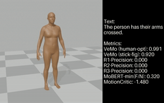<br/>
<b>001014 · MDM</b>
</td>
<td align="left" valign="top" width="20%">
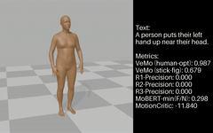<br/>
<b>001359 · MDM</b>
</td>
<td align="left" valign="top" width="20%">
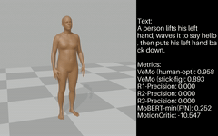<br/>
<b>001384 · MDM</b>
</td>
<td align="left" valign="top" width="20%">
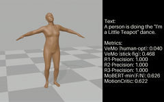<br/>
<b>000439 · MDM</b>
</td>
<td align="left" valign="top" width="20%">
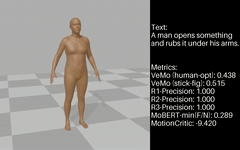<br/>
<b>001349 · MDM</b>
</td>
</tr>
<tr>
<td align="left" valign="top" width="20%">
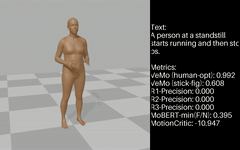<br/>
<b>000825 · MotionGPT</b>
</td>
<td align="left" valign="top" width="20%">
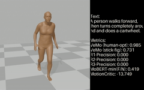<br/>
<b>001008 · MotionGPT</b>
</td>
<td align="left" valign="top" width="20%">
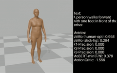<br/>
<b>000374 · MotionGPT</b>
</td>
<td align="left" valign="top" width="20%">
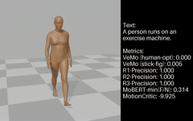<br/>
<b>001250 · MotionGPT</b>
</td>
<td align="left" valign="top" width="20%">
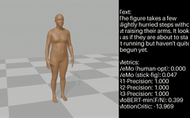<br/>
<b>000307 · MotionGPT</b>
</td>
</tr>
<tr>
<td align="left" valign="top" width="20%">
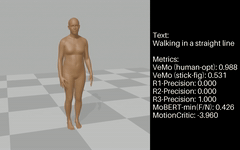<br/>
<b>000704 · MotionLCM</b>
</td>
<td align="left" valign="top" width="20%">
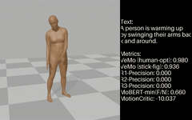<br/>
<b>001038 · MotionLCM</b>
</td>
<td align="left" valign="top" width="20%">
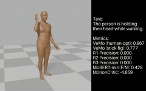<br/>
<b>001059 · MotionLCM</b>
</td>
<td align="left" valign="top" width="20%">
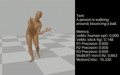<br/>
<b>000576 · MotionLCM</b>
</td>
<td align="left" valign="top" width="20%">
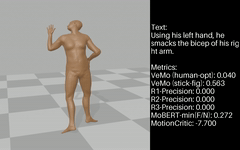<br/>
<b>000820 · MotionLCM</b>
</td>
</tr>
<tr>
<td align="left" valign="top" width="20%">
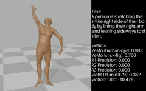<br/>
<b>000742 · StableMoFusion</b>
</td>
<td align="left" valign="top" width="20%">
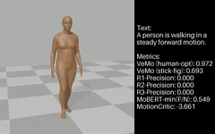<br/>
<b>000304 · StableMoFusion</b>
</td>
<td align="left" valign="top" width="20%">
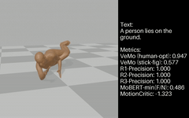<br/>
<b>000091 · StableMoFusion</b>
</td>
<td align="left" valign="top" width="20%">
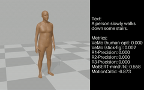<br/>
<b>000421 · StableMoFusion</b>
</td>
<td align="left" valign="top" width="20%">
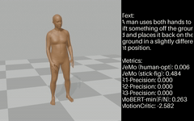<br/>
<b>000749 · StableMoFusion</b>
</td>
</tr>
</table>
</div>


<h2 align="left">⚙️ Setup</h2>

```bash
cd VeMo
conda create -n vemo python=3.11
conda activate vemo
pip install -r requirements.txt
```

<h2 align="left">📦 Resources</h2>

- Download [OpenGVLab/InternVL3-14B](https://huggingface.co/OpenGVLab/InternVL3-14B) to `./storage/vlm/InternVL3_14B`.
- Released rendering utilities are in `./src/visualize` and `./src/blender`.
- Coarse-grained labels for reproducing the main results are in `./storage/eval_scores`.
- Extra evaluation resources are in `./storage/eval_scores_extra`.
- A demo motion clip is included at `./demo/demo.mp4`.

<h2 align="left">🧩 Quick Start</h2>

Run VeMo on the bundled demo sample:

```bash
python demo/demo.py
```

For a visual preview, open `./demo/demo.mp4`.

<h2 align="left">🎬 More Demos</h2>

- [Stick-figure video demos](https://drive.google.com/file/d/1RybEz4m5ywAopx7t_qWg6HYSNf7ppOnh/view?usp=sharing)
- [Full-body video demos](https://drive.google.com/file/d/1huP1QV0Sn5G9_OL4--gDW6cO-2ogNV5B/view?usp=sharing)
- [Demos with preset metric overlays](https://drive.google.com/file/d/1U5jnVd-A4JPgFIlhk6fHjbceEpTJMk69/view?usp=sharing)

To add metric overlays to downloaded videos:

```bash
python src/visualize/show_metrics_on_videos.py
```

<h2 align="left">🔁 Reproduce Main Results</h2>

```bash
python src/evaluate_system.py
```

<h2 align="left">🧠 Notes</h2>

- The main pipeline uses video-language scoring rather than motion-specific evaluator training.
- The README paths above assume commands are run from `VeMo/`.
- If you want to regenerate videos, inspect `./src/blender` and `./src/visualize`.

<h2 align="left">Citation</h2>

```bibtex
@inproceedings{ji2026vemo,
  title={Zero-Shot Text-to-Motion Evaluation using Video Language Models},
  author={Ji, Yuwen and Wang, Donglin and Zhang, Yue},
  booktitle={International Conference on Machine Learning},
  year={2026},
  url={https://openreview.net/forum?id=Sf8ubkiEkW}
}
```
